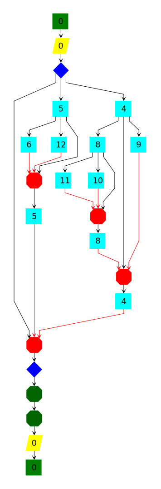

# Otter
> An OMPT Tool for Tracing OpenMP Tasks

Otter is a tool for visualising the structure of task-based OpenMP programs allowing developers and researchers to see the true structure of their OpenMP 5.0 programs from the perspective of the OpenMP runtime, without any modification of the target application.

Otter uses the OpenMP Tools interface in [OpenMP 5.0](https://www.openmp.org/spec-html/5.0/openmpch4.html) to observe task creation and synchronisation events, extracting from this data the structure of a target application independent of the particular scheduling of tasks at runtime.

## Example

Take this example code which uses nested tasks synchronised by a taskwait barrier to calculate the n<sup>th</sup> Fibonacci number:

```c
int fibonacci(int n) {
    int i, j;
    if (n<2) return n;
    #pragma omp task shared(i) firstprivate(n)
        i = f(n-1);
    #pragma omp task shared(j) firstprivate(n)
        j = f(n-2);
    #pragma omp taskwait
    return i+j;
}
```

We can speculate about the structure of this code in terms of tasks and their synchronisation, but how can we check that our ideas match reality? This is a challenge even for the simple code above, and soon becomes impossible for complex task-based code. We might try using performance analysis tools to trace or profile an application, providing a thread-centric view of a specific arrangement of tasks. While this gives us insight into the application's runtime performance, we would still struggle to get a clear picture of the application's overall structure. Using Otter we can observe the true structure of a task-based OpenMP application, all without modifying the application's source. Here is the result of applying Otter to a program using the Fibonacci function above:

<p align="center">

</p>

The nodes of this graph represent the different OpenMP constructs that Otter can show:

<p align="center">

</p>

# Getting Started

## Prerequisites

The following dependencies should be installed before building Otter:

- A recent version of a compiler supporting OMPT, such as Clang or Intel's one-API compilers.
- [OTF2 v2.3](https://zenodo.org/record/4682684)
- [`python-igraph` v0.9.1](https://pypi.org/project/python-igraph/0.9.1/)

## Building Otter

To build the runtime tool and install post-processing python components:

```bash
git clone https://github.com/adamtuft/otter.git && cd otter
git checkout main
CC=<your-C-compiler> CXX=<your-C++-compiler> make
pip install src/python/
```

You can also run `make all` to build several simple OpenMP programs which can be useful to check everything works as expected.

## Using Otter

There is no need to `make install` Otter - tracing a target application `omp-demo` is as simple as:

```bash
OMP_TOOL_LIBRARIES=lib/libotter.so ./omp-demo
```

If everything is set up correctly, you should see output like this (depending on the specific OpenMP runtime you are using):

```
Intel(R) OMP version: 5.0.20210428, OMP v. 201611
Otter was compiled with icc (ICC) 2021.3.0 20210609
Starting OTTer...
Trace output path:             trace/otter_trace.[pid]

Registering callbacks:
ompt_callback_thread_begin       | ompt_set_always (5)
ompt_callback_thread_end         | ompt_set_always (5)
ompt_callback_parallel_begin     | ompt_set_always (5)
ompt_callback_parallel_end       | ompt_set_always (5)
ompt_callback_task_create        | ompt_set_always (5)
ompt_callback_task_schedule      | ompt_set_always (5)
ompt_callback_implicit_task      | ompt_set_always (5)
ompt_callback_work               | ompt_set_always (5)
ompt_callback_masked             | ompt_set_always (5)
ompt_callback_sync_region        | ompt_set_always (5)

PROCESS RESOURCE USAGE:
       maximum resident set size:    11916 kb
page reclaims (soft page faults):     5644 
  page faults (hard page faults):        1 
          block input operations:        0 
         block output operations:       72 

                         threads:        3 
                parallel regions:        2 
                           tasks:       25 
OTTER_TRACE_FOLDER=/home/adam/otter/trace/otter_trace.[pid]
```

By default, Otter writes a trace to `trace/otter_trace.[pid]` - the location and name of the trace can be set with the `OTTER_TRACE_PATH` and `OTTER_TRACE_NAME` environment variables.

The contents of the trace can be converted into a graph with:

```bash
python3 -m otter trace/otter_trace.[pid]/otter_trace.[pid].otf2 -o graph.dot
```

The graph, saved to `graph.dot`, can then be visualised using the `dot` command line tool included with [Graphviz](https://graphviz.org/) or a graph visualisation tool such as [yEd-Desktop or yEd-Live](https://www.yworks.com/\#products).

# Features

- Trace the task creation and synchronisation constructs of an OpenMP 5.0 program without any modification of the source - no need to add any instrumentation to the target application.
- Supports synchronisation due to taskwait and taskgroup constructs.
- Supports nested tasks and nested parallelism.
- No additional thread synchronisation - won't accidentally serialise the target application.
- Low runtime overhead.

# Future Work

The future direction of development may include, in no particular order:

- [ ] Record and visualise actual work done per task.
- [ ] Automatic detection of the critical path.
- [ ] Support for MPI+OpenMP applications.
- [ ] Support for GPU-offloaded tasks.
- [ ] Stronger graph visualisation capabilities.

# Contributing

Contributions are welcome! If you would like to contribute, please fork the repository and use the `contributions` branch. There is no specific style guide, although I would be grateful if you could code in a style consistent with that of the main project.

# Issues, Questions and Feature Requests

Please post any of the above here: https://github.com/adamtuft/otter/issues

# Licensing

Otter is released under the BSD 3-clause license. See LICENSE.md for details.

Copyright (c) 2021, Adam Tuft
All rights reserved.

# Acknowledgements

Otter was conceived and developed as the subject of a final project and dissertation for the the [Scientific Computing and Data Analysis MSc](https://miscada.phyip3.dur.ac.uk/) (MISCADA) at Durham University, UK. The author is grateful for the guidance and support of his supervisor Prof. Tobias Weinzierl and for the invaluable assistance provided by Dr. Holger Schulz.